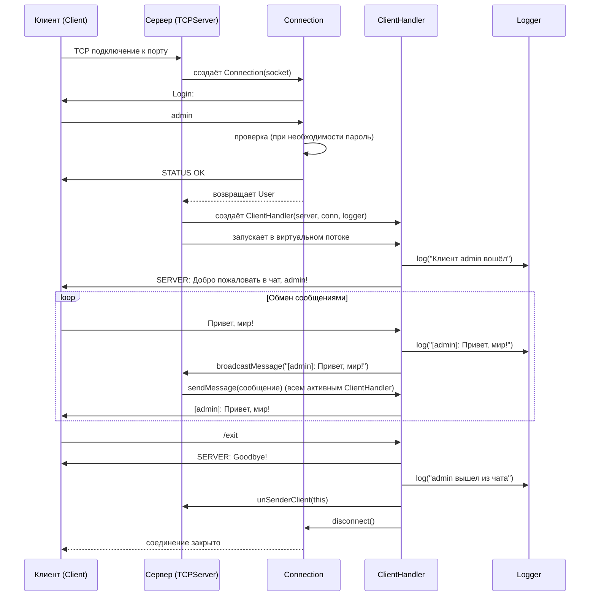

# Курсовой проект - NetWork (Серверный чат)
##
### Основные классы и особенности приложения и методов.
<u>1. Application (пакет netWork)</u>
```Определение: Точка входа всего серверного приложения.
   Главный метод: main(String[] args) – создаёт экземпляр Settings, получает порт и запускает TCPServer.
   Особенности: Предельно тонкий, не содержит бизнес-логики.
```
<u>2. Settings (пакет netWork.config)</u>
~~~
Определение: Загружает и хранит параметры конфигурации из файла settings.txt в classpath.
   Главные методы:
getPort() – порт сервера (по умолчанию 8888).
getHost() – хост сервера (по умолчанию localhost).
getDefaultUsername() – имя пользователя по умолчанию (может быть null).
getLoginPass(String login) – возвращает пароль для заданного логина (используется, если включена аутентификация по паролю).
Особенности:
Загрузка происходит в конструкторе один раз.
При отсутствии файла выбрасывает RuntimeException.
Значения по умолчанию заданы прямо в коде – это защита от неполной конфигурации.
~~~
<u>3. Connection (пакет netWork.server)</u>
````
Класс Connection — это обработчик одного клиентского соединения, работающий в отдельном потоке. Для того чтоб 
как-то им управлять. А именно: Connection — это протокол (протокольная фаза в зависимости от потребностей), которая предшествует основному чату и передаёт
уже готового, аутентифицированного пользователя в ClientHandler. Работает как изолированный диалоговый автомат, не влияя на остальную систему.
Определение: Отвечает за первоначальное рукопожатие с клиентом: запрос логина, опциональную проверку пароля и создание объекта User. 
Реализует Runnable метод кгт(), выполняется в отдельном потоке.

````
<u>4.User (пакет netWork.chatServiceUser)</u>
~~~
Определение: Простая модель пользователя чата.
Главный метод: getName() – возвращает имя, с которым пользователь вошёл.
Особенности: Используется как значение-объект (value object), неизменяемый (поле final). Может быть расширен полями роль, статус и т.д.
~~~
<u>5.ClientHandler (пакет netWork.server)</u>
~~~
ClientHandler - Его задача: обслуживать одного клиента на сервере. При создании он запускает отдельный поток для чтения сообщений 
от клиента и ретрансляции их всем остальным (через серверный broadcast).
Также хранит сокет для отправки сообщений этому клиенту (sendMessage вызывается сервером при рассылке). 
В finally, когда клиент отключается (исключение или конец потока), он удаляет себя из списка клиентов сервера.
Определение: Обработчик активной сессии одного клиента. Запускается в виртуальном потоке, читает сообщения от клиента, логирует их, 
рассылает всем остальным через сервер, обрабатывает команду /exit.
~~~
<u>6. TCPServer (пакет netWork.server)</u>
~~~
Добавляем клиента в список рассылки и под него создаем обработчик - private List<ClientHandler> clients;
Метод классса Server - broadcastMessage(String msg) - Это широковещательная рассылка. 
Сервер пройдется по клиентам и каждому из них отправит сообщение.
~~~
~~~
простой утилитный класс Logger, который пишет строки в файл с временными метками.
~~~
~~~
1.К методам можно отнести ServerBroadcast - серверная широковещательная рассылка сообщений. Подписка и отписка.
2.Соответственно класс Conection в отличии от класса Socket то есть протокол.
~~~
<<<<<<< HEAD
 Программа многопоточная:
 Итого на сервере:
 1 обычный поток (приём соединений),
 2N виртуальных потоков (N на аутентификацию + N на чат).(Для каждого клиента создаются 2 виртуальных потока)
 Итого на клиенте:
 2 обычных потока: главный поток отвечает за ввод и отправку сообщений, дополнительный поток непрерывно читает входящие сообщения 
 от сервера и выводит их в консоль.
=======
Программа многопоточная:
Итого на сервере:
1 обычный поток (приём соединений),
2N виртуальных потоков (N на аутентификацию + N на чат).(Для каждого клиента создаются 2 виртуальных потока)
Итого на клиенте:
2 обычных потока: главный поток отвечает за ввод и отправку сообщений, дополнительный поток непрерывно читает входящие сообщения
от сервера и выводит их в консоль.
>>>>>>> 5acede5 (Обновлённые классы, сессия и новые тесты)

## UML-диаграмма последовательности (типичный сценарий)



## Диаграмма классов (общая)

```mermaid
classDiagram
    class TCPServer {
        -int port
        -List~ClientHandler~ clients
        -ExecutorService executor
        -Logger serverLogger
        +start() void
        +broadcastMessage(String msg) void
        +addClient(ClientHandler handler) void
        +unSenderClient(ClientHandler handler) void
    }

    class ServerIntf {
        <<interface>>
        +start() void
        +broadcastMessage(String msg) void
        +addClient(ClientHandler handler) void
        +unSenderClient(ClientHandler handler) void
    }

    class Connection {
        -Socket netClient
        -BufferedReader fromClient
        -PrintWriter toClient
        -boolean authenticated
        -boolean authenticatedChat
        -User user
        +Connection(Socket client, Settings settings)
        +run() void
        +isAuthenticated() boolean
        +getUser() User
        +getReader() BufferedReader
        +getWriter() PrintWriter
        +disconnect() void
    }

    class ClientHandler {
        -ServerIntf server
        -Connection connection
        -BufferedReader in
        -PrintWriter out
        -Logger logger
        -String clientName
        +ClientHandler(ServerIntf server, Connection connection, Logger logger)
        +run() void
        +sendMessage(String msg) void
    }

    class Client {
        +start(int port) void
        -clientStart(int port) void
        +main(String[] args) void
    }

    class Settings {
        -Properties properties
        +getPort() int
        +getHost() String
        +getDefaultUsername() String
        +getLoginPass(String login) String
    }

    class Logger {
        -String filePath
        -DateTimeFormatter DT_FORMAT
        +log(String message) void
    }

    class User {
        -String name
        +User(String name)
        +getName() String
    }

    TCPServer ..|> ServerIntf
    TCPServer --> ClientHandler : содержит список
    TCPServer --> Connection : создаёт
    TCPServer --> Logger : использует

    ClientHandler --> ServerIntf : взаимодействует
    ClientHandler --> Connection : использует
    ClientHandler --> Logger : использует
    ClientHandler --> User : получает имя

    Connection --> User : создаёт
    Connection --> Settings : использует

    Client --> Settings : читает настройки
    Client --> Logger : использует

    Logger --> "файл" : пишет в файл
    Settings --> "settings.txt" : читает
```
